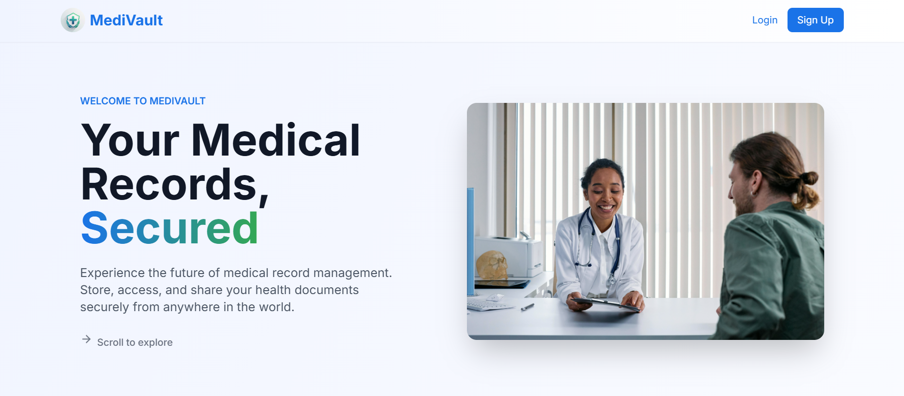
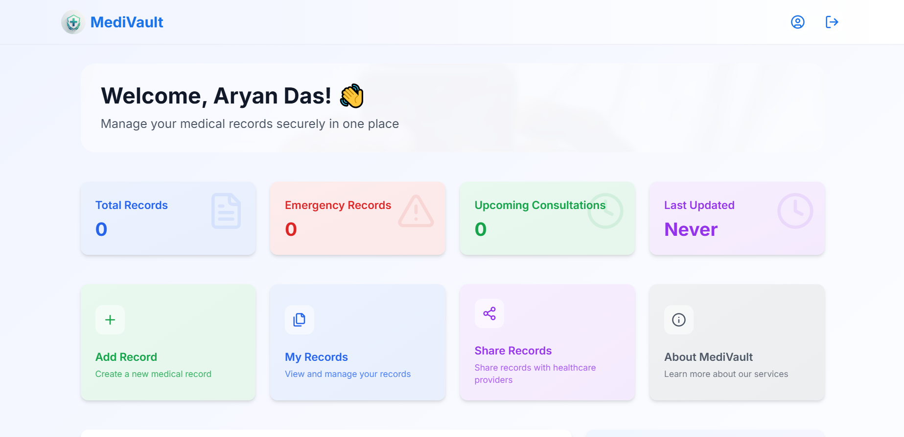
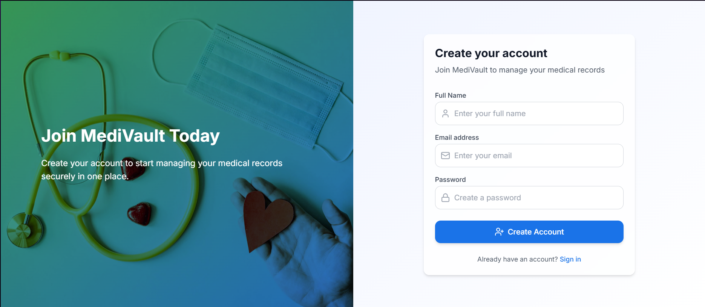

# 🩺 MediVault

**A secure digital wallet for managing and sharing medical records.**

MediVault is a clean, AI-generated web app that empowers patients to take control of their health records. Users can upload, edit, and manage their medical data, and share it via secure QR codes. The project uses **React**, **Supabase**, and **Tailwind CSS** — all generated with **Bolt AI**.

> ⚠️ **Note:** This project is under development and may have some functional issues. We welcome the community to contribute via pull and push requests!

---

## 📸 Screenshots

_Add relevant screenshots below to show the UI and key features._

>   
> _Landing Page Interface_

>   
> _User Dashboard_

>   
> _Register_

---

## ✨ Features

- Add, edit, and delete medical records
- Secure QR code sharing for quick doctor access
- Profile management with editable personal health data
- Search and filter through records easily
- Responsive UI built with Tailwind CSS
- Clean, consistent design generated using Bolt AI

---

## 🔧 Built With

- **React.js**
- **Supabase** (PostgreSQL, Auth, File Storage)
- **Tailwind CSS**
- **Bolt AI** (No hand-written code)

---

## 📦 Setup Instructions

1. Clone the repository:

   ```bash
   https://github.com/aryandas2911/MediVault.git
   cd MediVault
